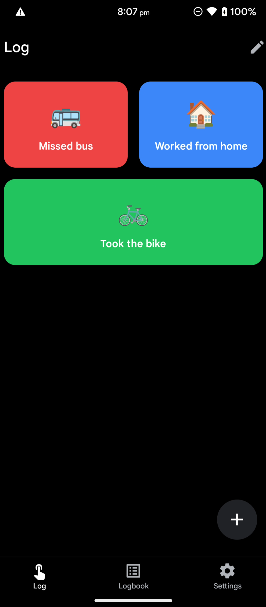
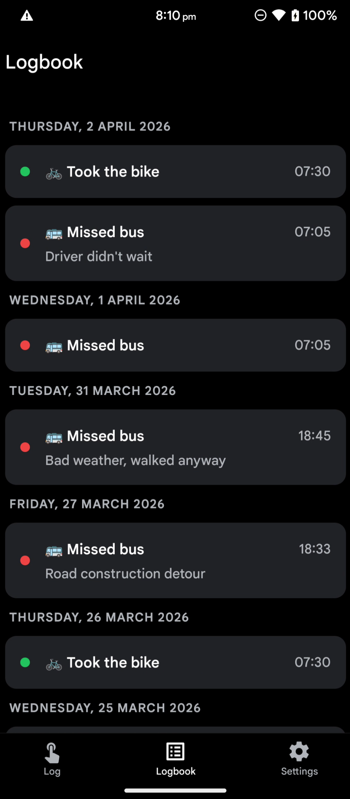
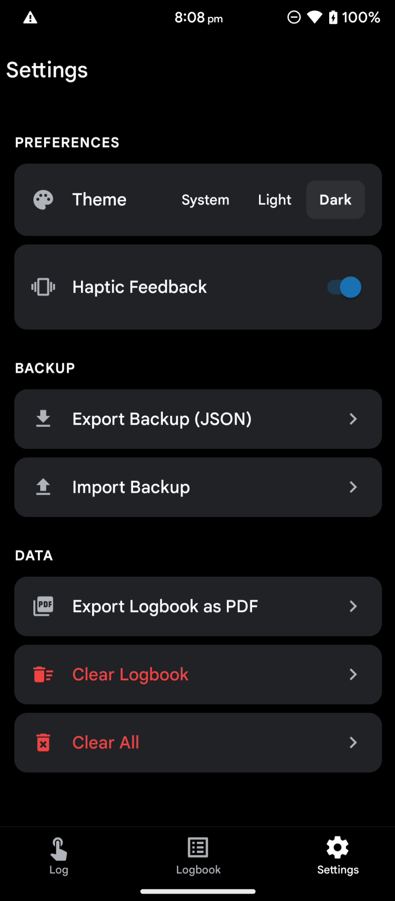
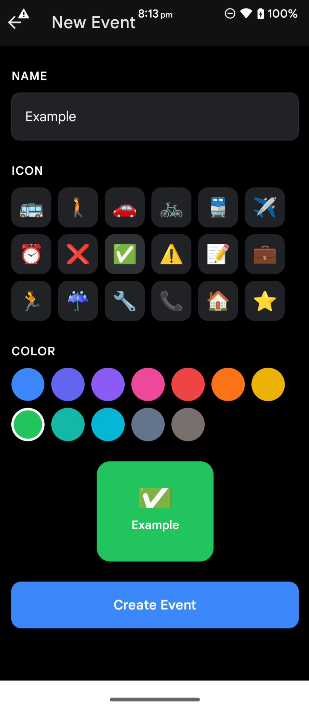
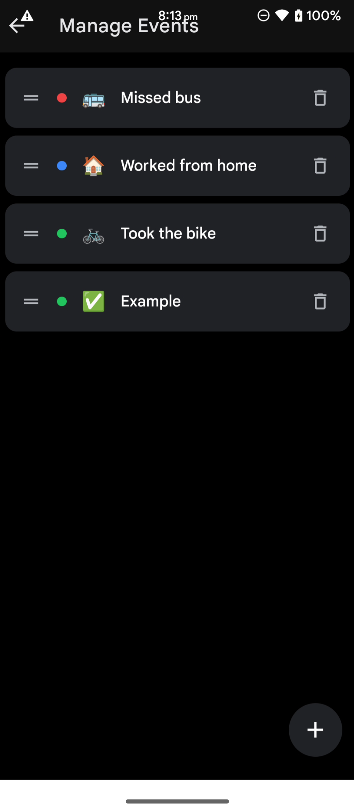

# TapLog

A simple event logging app. Create custom events, tap to log them with a timestamp, and review your logbook later.

## Why

Built to solve a specific problem: tracking missed bus rides during a daily commute. When the bus doesn't show up, tap a button to log it. After a few months, export the logbook to see exactly which days and times you went by foot.

Works for any recurring event you want to track with minimal friction.

## Features

- **Tap to log** - create custom event types that appear as large buttons on the home screen. One tap logs the event with the current timestamp. Long-press to add a note.
- **Logbook** - all entries grouped by day, most recent first. Tap an entry to edit its note, long-press to delete.
- **Event management** - full CRUD for event types with custom emoji icons and colors. Drag to reorder.
- **PDF export** - export the logbook as a formatted PDF.
- **Backup/restore** - export all data as JSON, import on another device. Fully local.
- **Dark mode** - system preference or manual toggle (System / Light / Dark).
- **Haptic feedback** - toggleable in settings.
- **Fully offline** - all data stored locally in SQLite. Nothing leaves your device.

## Screenshots

<p>
  
  
  
  
  
</p>

## Development

### Getting Started

```bash
pnpm install
pnpm start
```

Scan the QR code with Expo Go, or press `a` to open on a connected Android device.

### Seed test data

```bash
./scripts/seed.sh on    # inject 3 months of realistic data
./scripts/seed.sh off   # remove seed after restart
```

### Production build

```bash
npx expo prebuild --platform android
cd android && JAVA_HOME=<path-to-jdk-21> ANDROID_HOME=<path-to-android-sdk> \
  ./gradlew app:assembleRelease
```

To build for arm64 only (reduces APK from ~98 MB to ~40 MB):

```bash
./gradlew app:assembleRelease -PreactNativeArchitectures=arm64-v8a
```

Output: `android/app/build/outputs/apk/release/app-release.apk`

Requires JDK 17-24, Android SDK, and a signing keystore configured in `android/gradle.properties`. See [Expo local production builds](https://docs.expo.dev/guides/local-app-production/) for full setup.

### Local dev build

```bash
npx expo run:android
```

## Tech Stack

- [Expo](https://expo.dev) (SDK 55) + React Native
- TypeScript
- `expo-sqlite` for local storage
- `expo-router` for file-based navigation
- `react-native-reanimated` for animations
- `expo-print` + expo-sharing for PDF export
